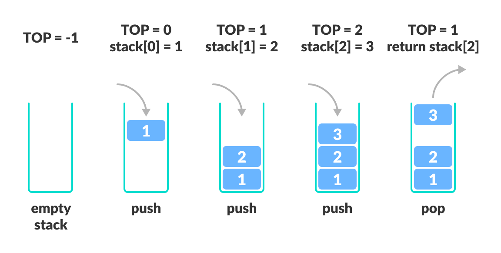

# Stack Data Structure


Link: https://www.programiz.com/dsa/stack


## Introduction

A stack is a linear data structure that follows the principle of **Last In First Out (LIFO)**. This means the last element inserted inside the stack is removed first.

You can think of the stack data structure as the pile of plates on top of another.

大意：

栈是遵循**后进先出(LIFO)**原则的线性数据结构。这意味着首先删除插入栈中的最后一个元素。

你可以将栈数据结构视为堆叠在另一个盘子上的盘子。

|  |
| :----------------------------------------------------------: |
| Stack representation similar to a pile of plate<br />栈就像是一堆盘子 |

Here, you can:

1.  Put a new plate on top
2.  Remove the top plate

And, if you want the plate at the bottom, you must first remove all the plates on top. This is exactly how the stack data structure works.

大意：

在这里，你可以：

1.  在上面放一个新盘子
2.  移除最顶上的盘子

而且，如果你想要底部的盘子，必须首先移除顶部的所有盘子。这正是堆栈数据结构的工作原理。


## LIFO Principle of Stack

栈的 LIFO 原则


In programming terms, putting an item on top of the stack is called **push** and removing an item is called **pop**.

大意：

在编程术语中，将项目放在堆栈顶部称为 **push**，删除项目称为 **pop**。

|  |
| :----------------------------------------------------------: |
|     Stack Push and Pop Operations<br />栈推入和弹出操作      |

In the above image, although item **3** was kept last, it was removed first. This is exactly how the **LIFO (Last In First Out) Principle** works.

大意：

在上图中，虽然项目 **3** 保留在最后，但它首先被删除。这正是 **LIFO（后进先出）原则**的工作原理。


## Basic Operations of Stack

栈的基本操作


There are some basic operations that allow us to perform different actions on a stack.

1.  **Push**: Add an element to the top of a stack.
2.  **Pop**: Remove an element from the top of a stack.
3.  **IsEmpty**: Check if the stack is empty.
4.  **IsFull**: Check if the stack is full.
5.  **Peek**: Get the value of the top element without removing it.

大意：

1.  **Push**：向栈顶添加一个元素。
2.  **Pop**：从栈顶移除一个元素。
3.  **IsEmpty**：检查堆栈是否为空。
4.  **IsFull**：检查堆栈是否已满。
5.  **Peek**：获取顶部元素的值而不删除它。


## Working of Stack Data Structure

栈数据结构的工作


The operations work as follows:

1.  A pointer called `TOP` is used to keep track of the top element in the stack.
2.  When initializing the stack, we set its value to `-1` so that we can check if the stack is empty by comparing `TOP == -1`.
3.  On pushing an element, we increase the value of `TOP` and place the new element in the position pointed to by `TOP`.
4.  On popping an element, we return the element pointed to by `TOP` and reduce its value.
5.  Before pushing, we check if the stack is already full.
6.  Before popping, we check if the stack is already empty.

大意：

操作如下：

1.  一个名为 `TOP` 的指针用于跟踪栈中的顶部元素。
2.  在初始化堆时，我们将其值设置为 `-1`，以便我们可以通过比较 `TOP == -1` 来检查堆栈是否为空。
3.  在推入一个元素时，我们增加 `TOP` 的值并将新元素放置在 `TOP` 指向的位置。
4.  在弹出一个元素时，我们返回由 `TOP` 指向的元素并减少它的值。
5.  在推入之前，我们检查栈是否已满。
6.  在弹出之前，我们检查栈是否已经为空。


|  |
| :----------------------------------------------------------: |
|    Working of Stack Data Structure<br />栈数据结构的工作     |


## Implement in C

The most common stack implementation is using arrays, but it can also be implemented using lists.

大意：

最常见的栈实现是使用数组，但也可以使用列表来实现。

```c
#include <stdio.h>
#include <stdlib.h>

#define MAX 10

int count = 0; // 方便得知需要循环几次才能打印完整 stack

// create a stack
struct stack
{
	int items[MAX];
	int top;
};

typedef struct stack st; // 给结构体起个别名

void createEmptyStack(st *s)
{
	s->top = -1;
}

// check if the stack is full
int isfull(st *s)
{
	if (s->top == MAX - 1) return 1;
	else return 0;
}

// check if the stack is empty
int isempty(st *s)
{
	if (s->top == -1) return 1;
	else return 0;
}

// add elements into stack
void push(st *s, int newitem)
{
	if (isfull(s))
	{
		printf("\nSTACK FULL!\n");
		return;
	}

	s->top++;
	s->items[s->top] = newitem;
	count++;
}

// remove element from stack
void pop(st *s)
{
	if (isempty(s))
	{
		printf("\nSTACK FULL!\n");
		return;
	}

	printf("Item popped = %d\n", s->items[s->top]);
	s->top--;
	count--;
}

// print elements of stack
void printStack(st *s)
{
	printf("Stack: ");

	for (int i = 0; i < count; i++) printf("%d ", s->items[i]);

	putchar('\n');
}

int main()
{
	st *s = (st *)malloc(sizeof(st));
	createEmptyStack(s);

	push(s, 1);
	push(s, 2);
	push(s, 3);
	push(s, 4);

	printStack(s);

	pop(s);

	printf("\nAfter popping out.\n");
	printStack(s);

	free(s);

	return 0;
}

/*
运行结果：

Stack: 1 2 3 4 
Item popped = 4

After popping out.
Stack: 1 2 3
*/
```


## Stack Time Complexity

For the array-based implementation of a stack, the `push` and `pop` operations take constant time, i.e. `O(1)`.

大意：

对于基于数组实现的栈，`push` 和 `pop` 操作需要常数时间，即`O(1)`。


## Applications of Stack Data Structure

Although stack is a simple data structure to implement, it is very powerful. The most common uses of a stack are:

1.  **To reverse a word**: Put all the letters in a stack and pop them out. Because of the **LIFO** order of stack, you will get the letters in reverse order.
2.  **In compilers**: Compilers use the stack to calculate the value of expressions like `2 + 4 / 5 * (7 - 9)` by converting the expression to prefix or postfix form.
3.  **In browsers**: he back button in a browser saves all the URLs you have visited previously in a stack. Each time you visit a new page, it is added on top of the stack. When you press the back button, the current URL is removed from the stack, and the previous URL is accessed.

大意：

栈数据结构的应用：

1.  **反转一个单词**：将所有字母放在一个栈中并将它们弹出。由于堆栈的 **LIFO** 顺序，你将获得相反顺序的字母。
2.  **在编译器中**：编译器通过将表达式转换为前缀或后缀形式，使用栈来计算表达式的值，例如 `2 + 4 / 5 * (7 - 9)`。
3.  **在浏览器中**：浏览器中的后退按钮会将你之前访问过的所有 URL 保存在栈中。每次访问新页面时，它都会添加到栈顶部。当你按下后退按钮时，当前 URL 将从栈中删除，并访问之前的 URL。


## 注意事项目

将 `stack` 这个单词翻译成“堆栈”是完全错误的！包括 Google 翻译也犯了这个错误！

在数据结构中，当然在 C 语言内存布局中也是。堆就是堆，英语是 `heap`；而栈则是栈，英语是 `stack`。两种完全不同的数据结构、内存布局。

这篇文章总结得比较好：https://www.cnblogs.com/idorax/p/6277906.html
