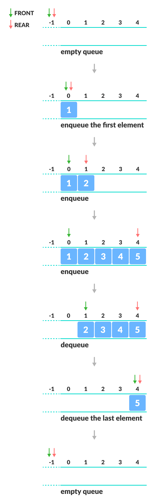
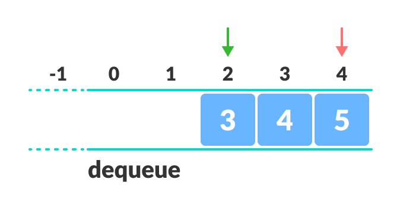

# Queue Data Structure


Link: https://www.programiz.com/dsa/queue


## Queue Specifications

队列规范


A queue is a useful data structure in programming. It is similar to the ticket queue outside a cinema hall, where the first person entering the queue is the first person who gets the ticket.

Queue follows the **First In First Out (FIFO)** rule - the item that goes in first is the item that comes out first.

大意：

队列是编程中一种有用的数据结构。类似于电影院外的售票队列，第一个进入队列的人就是第一个拿到票的人。

队列遵循**先进先出 (FIFO)** 规则 - 先进入的项目是先出来的项目。

|  |
| :----------------------------------------------------------: |
|      FIFO Representation of Queue<br />队列的 FIFO 表示      |

In the above image, since `1` was kept in the queue before `2`, it is the first to be removed from the queue as well. It follows the **FIFO** rule.

大意：

在上图中，由于 `1` 在 `2` 之前保留在队列中，因此它也是第一个从队列中删除的。它遵循 **FIFO** 规则。


In programming terms, putting items in the queue is called **enqueue**, and removing items from the queue is called **dequeue**.

大意：

在编程术语中，将项目放入队列称为**入队**，从队列中移除项目称为**出队**。


## Basic Operations of Queue

队列的基本操作


A queue is an object (an abstract data structure - ADT) that allows the following operations:

1.  **Enqueue**: Add an element to the end of the queue
2.  **Dequeue**: Remove an element from the front of the queue
3.  **IsEmpty**: Check if the queue is empty
4.  **IsFull**: Check if the queue is full
5.  **Peek**: Get the value of the front of the queue without removing it

大意：

队列是一个对象（一种抽象数据结构 - ADT），它允许以下操作：

1.  **入队**：向队列末尾添加一个元素
2.  **出队**：从队列前面移除一个元素
3.  **IsEmpty**：检查队列是否为空
4.  **IsFull**：检查队列是否已满
5.  **Peek**：获取队列最前面的值而不移除


## Working of Queue

队列的工作


Queue operations work as follows:

1.  two pointers `FRONT` and `REAR`
2.  `FRONT` track the first element of the queue
3.  `REAR` track the last element of the queue
4.  initially, set value of `FRONT` and `REAR` to `-1`

大意：

队列操作的工作方式如下：

1.  两个指针 `FRONT` 和 `REAR`
2.  `FRONT` 跟踪队列的第一个元素
3.  `REAR` 跟踪队列的最后一个元素
4.  最初，将 `FRONT` 和 `REAR` 的值设置为 `-1`


### Enqueue Operation

入队操作

1.  check if the queue is full
2.  for the first element, set the value of `FRONT` to `0`
3.  increase the `REAR` index by `1`
4.  add the new element in the position pointed to by `REAR`

大意：

1.  检查队列是否已满
2.  对于第一个元素，将 `FRONT` 的值设置为 `0`
3.  将 `REAR` 索引增加 `1`
4.  在 `REAR` 指向的位置添加新元素


### Dequeue Operation

出队操作

1.  check if the queue is empty
2.  return the value pointed by `FRONT`
3.  increase the `FRONT` index by `1`
4.  for the last element, reset the values of `FRONT` and `REAR` to `-1`

大意：

1.  检查队列是否为空
2.  返回 `FRONT` 指向的值
3.  将 `FRONT` 索引增加 `1`
4.  对于最后一个元素，将 `FRONT` 和 `REAR` 的值重置为 `-1`


### Enqueue and Dequeue Operations

|  |
| :----------------------------------------------------------: |
|                Enqueue and Dequeue Operations                |


## Implement in C

```c
#include <stdio.h>

#define SIZE 5

int items[SIZE], front = -1, rear = -1;

void enQueue(int value)
{
	if (rear == SIZE - 1)
	{
		printf("\nQueue is full!\n");
		return;
	}

	if (front == -1) front = 0;
	rear++;
	items[rear] = value;
	printf("\nInserted -> %d.\n", value);
}

void deQueue()
{
	if (front == -1)
	{
		printf("\nQueue is empty!\n");
		return;
	}

	printf("\nDeleted : %d.\n", items[front]);
	front++;
	if (front > rear) front = rear = -1;
}

void display()
{
	if (rear == -1)
	{
		printf("\nQueue is empty! do not dispaly!\n");
		return;
	}

	printf("\nQueue: ");
    // 因为第 rear 个位置的元素也需要打印，所以是 i<=rear，或者 i<rear+1
	for (int i = front; i <= rear; i++) printf("%d ", items[i]);
    putchar('\n');
}

int main()
{
	// deQueue is not possible on empty queue
	deQueue();

	// enQueue 5 elements
	enQueue(1);
	enQueue(2);
	enQueue(3);
	enQueue(4);
	enQueue(5);

	// 6th element can't be added to because the queue is full
	enQueue(6);

	display();

	// deQueue removes element entered first i.e. 1
	deQueue();

	// Now we have just 4 elements
	display();
    
	return 0;
}

/*
运行结果：

Queue is empty!

Inserted -> 1.

Inserted -> 2.

Inserted -> 3.

Inserted -> 4.

Inserted -> 5.

Queue is full!

Queue: 1 2 3 4 5 

Deleted : 1.

Queue: 2 3 4 5
*/
```


## Limitations of Queue

队列的局限性


As you can see in the image below, after a bit of enqueuing and dequeuing, the size of the queue has been reduced.

大意：

如下图所示，经过一些入队和出队后，队列的大小已经减小。

|  |
| :----------------------------------------------------------: |
|                    Limitation of a queue                     |

And we can only add indexes `0` and `1` only when the queue is reset (when all the elements have been dequeued).

大意：

并且我们只能在队列重置时（当所有元素都已出队时）添加索引 `0` 和 `1`。


After `REAR` reaches the last index, if we can store extra elements in the empty spaces (`0` and `1`), we can make use of the empty spaces. This is implemented by a modified queue called the circular queue.

大意：

在 `REAR` 到达最后一个索引后，如果我们可以在空白空间（`0` 和 `1`）中存储额外的元素，我们就可以利用这些空白空间。这是由称为循环队列的修改队列实现的。


## Complexity Analysis

复杂度分析

The complexity of enqueue and dequeue operations in a queue using an array is `O(1)`. If you use `pop(N)` in python code, then the complexity might be `O(n)` depending on the position of the item to be popped.

大意：

使用数组的队列中入队和出队操作的复杂性为 `O(1)`。如果在 python 代码中使用 `pop(N)`，那么复杂度可能是 `O(n)`，具体取决于要弹出的项目的位置。


## Applications of Queue

1.  CPU scheduling, Disk Scheduling
2.  When data is transferred asynchronously between two processes.The queue is used for synchronization. For example: IO Buffers, pipes, file IO, etc
3.  Handling of interrupts in real-time systems
4.  Call Center phone systems use Queues to hold people calling them in order

大意：

队列的应用场景：

1.  CPU 调度、磁盘调度
2.  当两个进程之间异步传输数据时，队列用于同步。例如：IO Buffers、管道、文件 IO 等
3.  处理实时系统中的中断
4.  呼叫中心电话系统使用队列来让人们按顺序呼叫他们