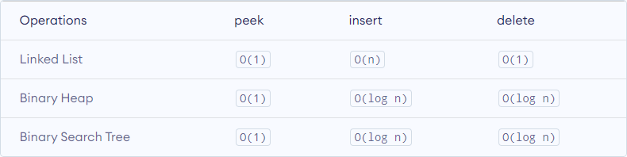

# Priority Queue


Link: https://www.programiz.com/dsa/priority-queue


## Definition

A priority queue is a **special type of queue** in which each element is associated with a **priority value**. And, elements are served on the basis of their priority. That is, higher priority elements are served first.

However, if elements with the same priority occur, they are served according to their order in the queue.

大意：

优先级队列是一种**特殊类型的队列**，其中每个元素都与一个**优先级值**相关联。并且，元素根据其优先级提供服务。即，首先服务更高优先级的元素。

但是，如果出现具有相同优先级的元素，则按照它们在队列中的顺序提供服务。


### Assigning Priority Value

分配优先级值


Generally, the value of the element itself is considered for assigning the priority. For example,

The element with the highest value is considered the highest priority element. However, in other cases, we can assume the element with the lowest value as the highest priority element.

We can also set priorities according to our needs.

大意：

通常，在分配优先级时考虑元素本身的值。例如，

具有最高值的元素被认为是最高优先级的元素。但是，在其他情况下，我们可以假设具有最低值的元素作为最高优先级元素。

我们还可以根据需要设置优先级。

|  |
| :----------------------------------------------------------: |
|  Removing Highest Priority Element<br />删除最高优先级元素   |


### Difference between Priority Queue and Normal Queue

优先队列和普通队列的区别


In a queue, the **first-in-first-out rule** is implemented whereas, in a priority queue, the values are removed **on the basis of priority**. The element with the highest priority is removed first.

大意：

在队列中，执行**先进先出规则**，而在优先级队列中，**根据优先级**删除值。首先删除具有最高优先级的元素。


## Implementation of Priority Queue

优先队列的实现


Priority queue can be implemented using an array, a linked list, a heap data structure, or a binary search tree. Among these data structures, heap data structure provides an efficient implementation of priority queues.

大意：

优先队列可以使用数组、链表、堆数据结构或二叉搜索树来实现。在这些数据结构中，堆数据结构提供了优先队列的有效实现。


Hence, we will be using the heap data structure to implement the priority queue in this tutorial. A max-heap is implement is in the following operations. If you want to learn more about it, please visit max-heap and mean-heap.

大意：

因此，我们将在本教程中使用堆数据结构来实现优先级队列。在以下操作中实现了最大堆。如果您想了解更多信息，请看 max-heap 和 mean-heap。


A comparative analysis of different implementations of priority queue is given below.

大意：

下面对优先队列的不同实现方式进行对比分析。




## Priority Queue Operations

优先队列操作


Basic operations of a priority queue are inserting, removing, and peeking elements.

>   Before studying the priority queue, please refer to the heap data structure for a better understanding of binary heap as it is used to implement the priority queue in this article.

大意：

优先级队列的基本操作是插入、移除和查看元素。

>   在研究优先队列之前，请参考堆数据结构以更好地理解二叉堆，因为它用于实现本文中的优先队列。


### 1. Inserting an Element into the Priority Queue

将元素插入优先队列


Inserting an element into a priority queue (max-heap) is done by the following steps.

大意：

通过以下步骤将元素插入优先级队列（最大堆）。

-   Insert the new element at the end of the tree.

    在树的末尾插入新元素。

    |  |
    | :----------------------------------------------------------: |
    | Insert an element at the end of the queue<br />在队列末尾插入一个元素 |

    

-   Heapify the tree.

    堆化树

    |  |
    | :----------------------------------------------------------: |
    |           Heapify after insertion<br />插入后堆化            |

    

Algorithm for insertion of an element into priority queue (max-heap)

大意：

将元素插入优先级队列的算法（最大堆）

```
If there is no node, 
  create a newNode.
else (a node is already present)
  insert the newNode at the end (last node from left to right.)
  
heapify the array
```

For Min Heap, the above algorithm is modified so that `parentNode` is always smaller than `newNode`.

大意：

对于最小堆，修改了上述算法，以便 `parentNode` 始终小于 `newNode`。


### 2. Deleting an Element from the Priority Queue

从优先队列中删除元素


Deleting an element from a priority queue (max-heap) is done as follows:

大意：

从优先级队列（最大堆）中删除元素的操作如下：

-   Select the element to be deleted.

    选择要删除的元素

    |  |
    | :----------------------------------------------------------: |
    |    Select the element to be deleted<br />选择要删除的元素    |

    

-   Swap it with the last element.

    将其与最后一个元素交换

    |  |
    | :----------------------------------------------------------: |
    | Swap with the last leaf node element<br />与最后一个叶节点元素交换 |

    

-   Remove the last element.

    删除最后一个元素

    |  |
    | :----------------------------------------------------------: |
    |    Remove the last element leaf<br />删除最后一个元素叶子    |

    

-   Heapify the tree.

    堆化树

    |  |
    | :----------------------------------------------------------: |
    |         Heapify the priority queue<br />堆化优先队列         |

    

Algorithm for deletion of an element in the priority queue (max-heap)

大意：

删除优先队列中元素的算法（最大堆）

```
If nodeToBeDeleted is the leafNode
  remove the node
Else swap nodeToBeDeleted with the lastLeafNode
  remove noteToBeDeleted
   
heapify the array
```

For Min Heap, the above algorithm is modified so that the both `childNodes` are smaller than `currentNode`.

大意：

对于最小堆，修改了上述算法，使两个 `childNodes` 都小于 `currentNode`。


### 3. Peeking from the Priority Queue (Find max/min)

从优先队列中查找（查找最大值/最小值）


Peek operation returns the maximum element from Max Heap or minimum element from Min Heap without deleting the node.

For both Max heap and Min Heap `return rootNode`.

大意：

Peek 操作返回最大堆的最大元素或最小堆的最小元素，而不删除节点。

对于最大堆和最小堆都 `return rootNode`。


### 4. Extract-Max/Min from the Priority Queue

从优先队列中提取最大值/最小值


Extract-Max returns the node with maximum value after removing it from a Max Heap whereas Extract-Min returns the node with minimum value after removing it from Min Heap.

大意：

Extract-Max 返回从最大堆中删除后具有最大值的节点，而 Extract-Min 返回从最小堆中删除后具有最小值的节点。


## Implement in C

```c
// Priority Queue implementation in C

#include <stdio.h>
int size = 0;
void swap(int *a, int *b) {
  int temp = *b;
  *b = *a;
  *a = temp;
}

// Function to heapify the tree
void heapify(int array[], int size, int i) {
  if (size == 1) {
    printf("Single element in the heap");
  } else {
    // Find the largest among root, left child and right child
    int largest = i;
    int l = 2 * i + 1;
    int r = 2 * i + 2;
    if (l < size && array[l] > array[largest])
      largest = l;
    if (r < size && array[r] > array[largest])
      largest = r;

    // Swap and continue heapifying if root is not largest
    if (largest != i) {
      swap(&array[i], &array[largest]);
      heapify(array, size, largest);
    }
  }
}

// Function to insert an element into the tree
void insert(int array[], int newNum) {
  if (size == 0) {
    array[0] = newNum;
    size += 1;
  } else {
    array[size] = newNum;
    size += 1;
    for (int i = size / 2 - 1; i >= 0; i--) {
      heapify(array, size, i);
    }
  }
}

// Function to delete an element from the tree
void deleteRoot(int array[], int num) {
  int i;
  for (i = 0; i < size; i++) {
    if (num == array[i])
      break;
  }

  swap(&array[i], &array[size - 1]);
  size -= 1;
  for (int i = size / 2 - 1; i >= 0; i--) {
    heapify(array, size, i);
  }
}

// Print the array
void printArray(int array[], int size) {
  for (int i = 0; i < size; ++i)
    printf("%d ", array[i]);
  printf("\n");
}

// Driver code
int main() {
  int array[10];

  insert(array, 3);
  insert(array, 4);
  insert(array, 9);
  insert(array, 5);
  insert(array, 2);

  printf("Max-Heap array: ");
  printArray(array, size);

  deleteRoot(array, 4);

  printf("After deleting an element: ");

  printArray(array, size);
}
```


## Priority Queue Applications

Some of the applications of a priority queue are:

1.  Dijkstra's algorithm
2.  for implementing stack
3.  for load balancing and interrupt handling in an operating system
4.  for data compression in Huffman code

大意：

优先队列的一些应用：

1.  Dijkstra 算法
2.  用于实现栈
3.  用于操作系统中的负载平衡和中断处理
4.  用于霍夫曼代码中的数据压缩