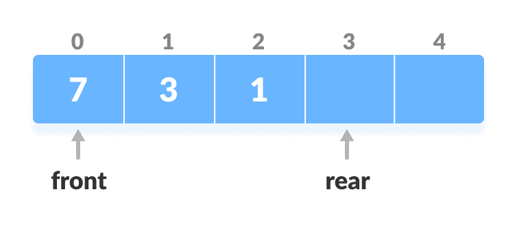

# Deque


Link: https://www.programiz.com/dsa/deque


## Definition

Deque or Double Ended Queue is a type of queue in which insertion and removal of elements can either be performed from the front or the rear. Thus, it does not follow FIFO rule (First In First Out).

大意：

双端队列是一种队列，其中元素的插入和删除可以从前面或后面执行。因此，它不遵循 FIFO 规则（先进先出）。

|  |
| :----------------------------------------------------------: |
|          Representation of Deque<br />Deque 的表示           |


## Types of Deque

双端队列的类型


### 1. Input Restricted Deque

输入受限双端队列

In this deque, input is restricted at a single end but allows deletion at both the ends.

大意：

在这个双端队列中，输入被限制在单端，但允许在两端删除。


### 2. Output Restricted Deque

输出受限双端队列

In this deque, output is restricted at a single end but allows insertion at both the ends.

大意：

在这个双端队列中，输出被限制在单端，但允许在两端插入。


## Operations on a Deque

双端队列的操作


Below is the circular array implementation of deque. In a circular array, if the array is full, we start from the beginning.

But in a linear array implementation, if the array is full, no more elements can be inserted. In each of the operations below, if the array is full, "overflow message" is thrown.

大意：

下面是双端队列的循环数组实现。在循环数组中，如果数组已满，我们从头开始。

但是在线性数组实现中，如果数组已满，则无法插入更多元素。在下面的每个操作中，如果数组已满，则会抛出“溢出消息”。


Before performing the following operations, these steps are followed.

1.  Take an array (deque) of size `n`.
2.  Set two pointers at the first position and set `front = -1` and `rear = 0`.

大意：

在执行以下操作之前，请遵循以下步骤。

1.  取一个大小为 `n` 的数组（双端队列）。
2.  在第一个位置设置两个指针，并设置 `front = -1` 和 `rear = 0`。

|  |
| :----------------------------------------------------------: |
| Initialize an array and pointers for deque<br />为 deque 初始化数组和指针 |


### 1. Insert at the Front

在前面插入


This operation adds an element at the front.

1.  Check the position of front.

    检查前面的位置

    |  |
    | :----------------------------------------------------------: |
    |       Check the position of front<br />检查前面的位置        |

    

2.  If `front < 1`, reinitialize `front = n-1` (last index).

    如果 `front < 1`，重新初始化 `front = n-1`（最后一个索引）

    |  |
    | :----------------------------------------------------------: |
    |             Shift front to the end<br />前移至尾             |

    

3.  Else, decrease `front` by `1`.

    否则，将 `front` 减少 `1`

    

4.  Add the new key `5` into `array[front]`.

    将新键 `5` 添加到 `array[front]` 中

    |  |
    | :----------------------------------------------------------: |
    |      Insert the element at Front<br />在 Front 插入元素      |

    

### 2. Insert at the Rear

在后面插入


This operation adds an element to the rear.

1.  Check if the array is full.

    检查数组是否已满

    |  |
    | :----------------------------------------------------------: |
    |         Check if deque is full<br />检查数组是否已满         |

    

2.  If the deque is full, reinitialize `rear = 0`.

    如果双端队列已满，则重新初始化 `rear = 0`

    

3.  Else, increase `rear` by `1`.

    否则，将 `rear` 增加 `1`

    |  |
    | :----------------------------------------------------------: |
    |               Increase the rear<br />rear 自加               |

    

4.  Add the new key `5` into `array[rear]`.

    将新的键 `5` 添加到 `array[rear]`

    |  |
    | :----------------------------------------------------------: |
    |        Insert the element at rear<br />在后面插入元素        |

    

### 3. Delete from the Front

从前面删除


The operation deletes an element from the front.

1.  Check if the deque is empty.

    检查双端队列是否为空

    |  |
    | :----------------------------------------------------------: |
    |      Check if deque is empty<br />检查双端队列是否为空       |

    

2.  If the deque is empty (i.e. `front = -1`), deletion cannot be performed (**underflow condition**).

    如果双端队列为空（即`front = -1`），则无法执行删除（**下溢条件**）。

    

3.  If the deque has only one element (i.e. `front = rear`), set `front = -1` and `rear = -1`.

    如果双端队列只有一个元素（即 `front=rear`），则设置 `front = -1`  和 `rear = -1`

    

4.  Else if `front` is at the end (i.e. `front = n - 1`), set go to the front `front = 0`.

    否则，如果 `front` 在末尾（即 `front = n - 1`），则设置转到最前面的 `front = 0`

    

5.  Else, `front = front + 1`.

    否则，`front = front + 1`

    |  |
    | :----------------------------------------------------------: |
    |              Increase the front<br />front 自加              |

    

### 4. Delete from the Rear

从后面删除


This operation deletes an element from the rear.

1.  Check if the deque is empty.

    检查双端队列是否为空

    |  |
    | :----------------------------------------------------------: |
    |      Check if deque is empty<br />检查双端队列是否为空       |

    

2.  If the deque is empty (i.e. `front = -1`), deletion cannot be performed (**underflow condition**).

    如果双端队列为空（即 `front = -1`），则无法执行删除（**下溢条件**）

    

3.  If the deque has only one element (i.e. `front = rear`), set `front = -1` and `rear = -1`, else follow the steps below.

    如果双端队列只有一个元素（即 `front=rear`），则设置 `front = -1` 和 `rear = -1`，否则按照以下步骤操作

    

4.  If `rear` is at the front (i.e. `rear = 0`), set go to the front `rear = n - 1`.

    如果 `rear` 在前面（即 `rear = 0`），设置转到前面 `rear = n - 1`

    

5.  Else, `rear = rear - 1`.

    否则，`rear = rear - 1`

    |  |
    | :----------------------------------------------------------: |
    |               Decrease the rear<br />rear 自减               |

    

### 5. Check Empty

This operation checks if the deque is empty. If `front = -1`, the deque is empty.

大意：

此操作检查双端队列是否为空。如果 `front = -1`，则双端队列为空。


### 6. Check Full

This operation checks if the deque is full. If `front = 0` and `rear = n - 1` OR `front = rear + 1`, the deque is full.

大意：

此操作检查双端队列是否已满。如果 `front = 0` 和 `rear = n - 1` 或 `front = rear + 1`，则双端队列已满。


## Implement in C

```c
#include <stdio.h>

#define MAX 10

void addFront(int *arr, int item, int *pfront, int *prear)
{
	int i, k, c;

	if (*pfront == 0 && *prear == MAX - 1)
	{
		puts("\nDeque is full.");
		return;
	}

	if (*pfront == -1)
	{
		*pfront = *prear = 0;
		arr[*pfront] = item;
		return;
	}

	if (*prear != MAX - 1)
	{
		c = count(arr);
		k = *prear + 1;

		for (i = 1; i <= c; i++)
		{
			arr[k] = arr[k - 1];
			k--;
		}

		arr[k] = item;
		*pfront = k;
		(*prear)++;
	}
	else
	{
		(*pfront)--;
		arr[*pfront] = item;
	}
}

void addRear(int *arr, int item, int *pfront, int *prear)
{
	int i, k;

	if (*pfront == 0 && *prear == MAX - 1)
	{
		puts("\nDeque is full.");
		return;
	}

	if (*pfront == -1)
	{
		*prear = *pfront = 0;
		arr[*prear] = item;
		return;
	}

	if (*prear == MAX - 1)
	{
		k = *pfront - 1;

		for (i = *pfront - 1; i < *prear; i++)
		{
			k = i;
			if (k == MAX - 1) arr[k] = 0;
			else arr[k] = arr[i + 1];
		}

		(*prear)--;
		(*pfront)--;
	}

	(*prear)++;
	arr[*prear] = item;
}

int delFront(int *arr, int *pfront, int *prear)
{
	int item;

	if (*pfront == -1)
	{
		puts("\nDeque is empty.");
		return 0;
	}

	item = arr[*pfront];
	arr[*pfront] = 0;

	if (*pfront == *prear) *pfront = *prear = -1;
	else (*pfront)++;

	return item;
}

int delRear(int *arr, int *pfront, int *prear)
{
	int item;

	if (*pfront == -1)
	{
		puts("\nDeque is empty.");
		return 0;
	}

	item = arr[*prear];
	arr[*prear] = 0;
	(*prear)--;
	if (*prear == -1) *pfront = -1;

	return item;
}

int count(int *arr)
{
	int c = 0;

	for (int i = 0; i < MAX; i++) if (arr[i] != 0) c++;

	return c;
}

void display(int *arr)
{
	for (int i = 0; i < MAX; i++) printf("%d  ", arr[i]);
}

int main()
{
	int arr[MAX], front = -1, rear = -1, i, n;

	for (i = 0; i< MAX; i++) arr[i] = 0;

	addRear(arr, 5, &front, &rear);
	addFront(arr, 12, &front, &rear);
	addRear(arr, 11, &front, &rear);
	addFront(arr, 5, &front, &rear);
	addRear(arr, 6, &front, &rear);
	addFront(arr, 8, &front, &rear);

	printf("\nElements in a deque: ");
	display(arr);

	i = delFront(arr, &front, &rear);
	printf("\nremoved item: %d", i);

	printf("\nElements in a deque after deletion: ");
	display(arr);

	addRear(arr, 16, &front, &rear);
	addRear(arr, 7, &front, &rear);

	printf("\nElements in a deque after addition: ");
	display(arr);

	i = delRear(arr, &front, &rear);
	printf("\nremoved item: %d", i);

	printf("\nElements in a deque after deletion: ");
	display(arr);

	n = count(arr);
	printf("\nTotal number of elements in deque: %d\n", n);

	return 0;
}


/*
运行结果：

Elements in a deque: 8  5  12  5  11  6  0  0  0  0  
removed item: 8
Elements in a deque after deletion: 0  5  12  5  11  6  0  0  0  0  
Elements in a deque after addition: 0  5  12  5  11  6  16  7  0  0  
removed item: 7
Elements in a deque after deletion: 0  5  12  5  11  6  16  0  0  0  
Total number of elements in deque: 6
*/
```


## Time Complexity

The time complexity of all the above operations is constant i.e. `O(1)`.

大意：

上述所有操作的时间复杂度是恒定的，即 `O(1)`。


## Applications of Deque Data Structure

1.  In undo operations on software.
2.  To store history in browsers.
3.  For implementing both stacks and queues.

大意：

双端队列的应用场景：

1.  在软件的撤销操作中
2.  在浏览器中存储历史记录
3.  用于实现栈和队列