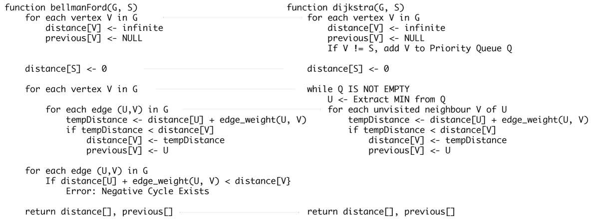

# Bellman Ford's Algorithm


Link: https://www.programiz.com/dsa/bellman-ford-algorithm


## Introduction

It is similar to [Dijkstra's algorithm](https://www.programiz.com/dsa/dijkstra-algorithm) but it can work with graphs in which edges can have negative weights.


## Why would one ever have edges with negative weights in real life?

Negative weight edges might seem useless at first but they can explain a lot of phenomena like cashflow, the heat released/absorbed in a chemical reaction, etc.

For instance, if there are different ways to reach from one chemical A to another chemical B, each method will have sub-reactions involving both heat dissipation and absorption.

If we want to find the set of reactions where minimum energy is required, then we will need to be able to factor in the heat absorption as negative weights and heat dissipation as positive weights.


## Why do we need to be careful with negative weights?

Negative weight edges can create negative weight cycles i.e. a cycle that will reduce the total path distance by coming back to the same point.

|  |
| :----------------------------------------------------------: |
| Negative weight cycles can give an incorrect result when trying to find out the shortest path |

Shortest path algorithms like Dijkstra's Algorithm that aren't able to detect such a cycle can give an incorrect result because they can go through a negative weight cycle and reduce the path length.


## How Bellman Ford's algorithm works

Bellman Ford algorithm works by overestimating the length of the path from the starting vertex to all other vertices. Then it iteratively relaxes those estimates by finding new paths that are shorter than the previously overestimated paths.

By doing this repeatedly for all vertices, we can guarantee that the result is optimized.

1.  Step-1

    |  |
    | :----------------------------------------------------------: |
    |             Step-1 for Bellman Ford's algorithm              |

    

2.  Step-2

    |  |
    | :----------------------------------------------------------: |
    |             Step-2 for Bellman Ford's algorithm              |

    

3.  Step-3

    |  |
    | :----------------------------------------------------------: |
    |             Step-3 for Bellman Ford's algorithm              |

    

4.  Step-4

    |  |
    | :----------------------------------------------------------: |
    |             Step-4 for Bellman Ford's algorithm              |

    

5.  Step-5

    |  |
    | :----------------------------------------------------------: |
    |             Step-5 for Bellman Ford's algorithm              |

    

6.  Step-6

    |  |
    | :----------------------------------------------------------: |
    |             Step-6 for Bellman Ford's algorithm              |


## Bellman Ford Pseudocode

We need to maintain the path distance of every vertex. We can store that in an array of size v, where v is the number of vertices.

We also want to be able to get the shortest path, not only know the length of the shortest path. For this, we map each vertex to the vertex that last updated its path length.

Once the algorithm is over, we can backtrack from the destination vertex to the source vertex to find the path.

```c
function bellmanFord(G, S)
  for each vertex V in G
    distance[V] <- infinite
      previous[V] <- NULL
  distance[S] <- 0

  for each vertex V in G				
    for each edge (U,V) in G
      tempDistance <- distance[U] + edge_weight(U, V)
      if tempDistance < distance[V]
        distance[V] <- tempDistance
        previous[V] <- U

  for each edge (U,V) in G
    If distance[U] + edge_weight(U, V) < distance[V}
      Error: Negative Cycle Exists

  return distance[], previous[]
```


## Bellman Ford vs Dijkstra

Bellman Ford's algorithm and Dijkstra's algorithm are very similar in structure. While Dijkstra looks only to the immediate neighbors of a vertex, Bellman goes through each edge in every iteration.

|  |
| :----------------------------------------------------------: |
|       Bellman Ford's Algorithm vs Dijkstra's Algorithm       |


## Implement in C
```c
// Bellman Ford Algorithm in C

#include <stdio.h>
#include <stdlib.h>

#define INFINITY 99999

//struct for the edges of the graph
struct Edge {
  int u;  //start vertex of the edge
  int v;  //end vertex of the edge
  int w;  //weight of the edge (u,v)
};

//Graph - it consists of edges
struct Graph {
  int V;        //total number of vertices in the graph
  int E;        //total number of edges in the graph
  struct Edge *edge;  //array of edges
};

void bellmanford(struct Graph *g, int source);
void display(int arr[], int size);

int main(void) {
  //create graph
  struct Graph *g = (struct Graph *)malloc(sizeof(struct Graph));
  g->V = 4;  //total vertices
  g->E = 5;  //total edges

  //array of edges for graph
  g->edge = (struct Edge *)malloc(g->E * sizeof(struct Edge));

  //------- adding the edges of the graph
  /*
		edge(u, v)
		where 	u = start vertex of the edge (u,v)
				v = end vertex of the edge (u,v)
		
		w is the weight of the edge (u,v)
	*/

  //edge 0 --> 1
  g->edge[0].u = 0;
  g->edge[0].v = 1;
  g->edge[0].w = 5;

  //edge 0 --> 2
  g->edge[1].u = 0;
  g->edge[1].v = 2;
  g->edge[1].w = 4;

  //edge 1 --> 3
  g->edge[2].u = 1;
  g->edge[2].v = 3;
  g->edge[2].w = 3;

  //edge 2 --> 1
  g->edge[3].u = 2;
  g->edge[3].v = 1;
  g->edge[3].w = 6;

  //edge 3 --> 2
  g->edge[4].u = 3;
  g->edge[4].v = 2;
  g->edge[4].w = 2;

  bellmanford(g, 0);  //0 is the source vertex

  return 0;
}

void bellmanford(struct Graph *g, int source) {
  //variables
  int i, j, u, v, w;

  //total vertex in the graph g
  int tV = g->V;

  //total edge in the graph g
  int tE = g->E;

  //distance array
  //size equal to the number of vertices of the graph g
  int d[tV];

  //predecessor array
  //size equal to the number of vertices of the graph g
  int p[tV];

  //step 1: fill the distance array and predecessor array
  for (i = 0; i < tV; i++) {
    d[i] = INFINITY;
    p[i] = 0;
  }

  //mark the source vertex
  d[source] = 0;

  //step 2: relax edges |V| - 1 times
  for (i = 1; i <= tV - 1; i++) {
    for (j = 0; j < tE; j++) {
      //get the edge data
      u = g->edge[j].u;
      v = g->edge[j].v;
      w = g->edge[j].w;

      if (d[u] != INFINITY && d[v] > d[u] + w) {
        d[v] = d[u] + w;
        p[v] = u;
      }
    }
  }

  //step 3: detect negative cycle
  //if value changes then we have a negative cycle in the graph
  //and we cannot find the shortest distances
  for (i = 0; i < tE; i++) {
    u = g->edge[i].u;
    v = g->edge[i].v;
    w = g->edge[i].w;
    if (d[u] != INFINITY && d[v] > d[u] + w) {
      printf("Negative weight cycle detected!\n");
      return;
    }
  }

  //No negative weight cycle found!
  //print the distance and predecessor array
  printf("Distance array: ");
  display(d, tV);
  printf("Predecessor array: ");
  display(p, tV);
}

void display(int arr[], int size) {
  int i;
  for (i = 0; i < size; i++) {
    printf("%d ", arr[i]);
  }
  printf("\n");
}
```


## Bellman Ford's Complexity

### Time Complexity


### Space Complexity

And, the space complexity is `O(V)`.


## Bellman Ford's Algorithm Applications

1.  For calculating shortest paths in routing algorithms
2.  For finding the shortest path

大意：

Bellman Ford 算法的应用场景：

1.  用于计算路由算法中的最短路径
2.  寻找最短路径