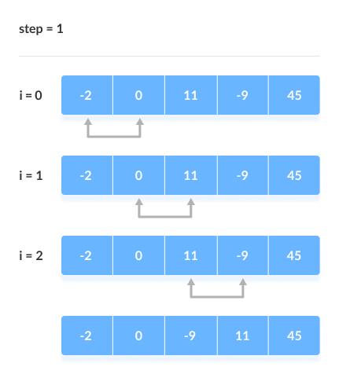
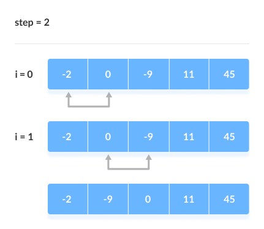

# Bubble Sort


Link: https://www.programiz.com/dsa/bubble-sort


## Introduction

Bubble sort is a sorting algorithm that compares two adjacent elements and swaps them until they are not in the intended order.

Just like the movement of air bubbles in the water that rise up to the surface, each element of the array move to the end in each iteration. Therefore, it is called a bubble sort.

大意：

冒泡排序是一种排序算法，它比较两个相邻元素并交换它们，直到它们不符合预期的顺序。

就像水中气泡上升到水面的运动一样，数组的每个元素在每次迭代中都移动到最后。因此，它被称为冒泡排序。


## Working of Bubble Sort

Suppose we are trying to sort the elements in **ascending order**.

大意：

假设我们试图**按升序**对元素进行排序。


### 1. First Iteration (Compare and Swap)

第一次迭代（比较和交换）

1.  Starting from the first index, compare the first and the second elements.

    大意：

    从第一个索引开始，比较第一个和第二个元素。

    

2.  If the first element is greater than the second element, they are swapped.

    大意：

    如果第一个元素大于第二个元素，则交换它们。

    

3.  Now, compare the second and the third elements. Swap them if they are not in order.

    现在，比较第二个和第三个元素。如果它们不按顺序，则交换它们。

    

4.  The above process goes on until the last element.

    上述过程一直持续到最后一个元素。

    

|  |
| :----------------------------------------------------------: |
|       Compare the Adjacent Elements<br />比较相邻元素        |


### 2. Remaining Iteration

剩余迭代

The same process goes on for the remaining iterations.

After each iteration, the largest element among the unsorted elements is placed at the end.

大意：

对剩余的迭代进行相同的过程。

每次迭代后，将未排序元素中最大的元素放在最后。

|  |
| :----------------------------------------------------------: |
| Put the largest element at the end<br />把最大的元素放在最后 |


In each iteration, the comparison takes place up to the last unsorted element.

大意：

在每次迭代中，比较发生到最后一个未排序的元素。

|  |
| :----------------------------------------------------------: |
|       Compare the adjacent elements<br />比较相邻元素        |


The array is sorted when all the unsorted elements are placed at their correct positions.

大意：

当所有未排序的元素都放在正确的位置时，数组就被排序了。

|  |
| :----------------------------------------------------------: |
| The array is sorted if all elements are kept in the right order<br />如果所有元素都以正确的顺序保存，则数组已排序 |


## Bubble Sort Algorithm

```
bubbleSort(array)
  for i <- 1 to indexOfLastUnsortedElement-1
    if leftElement > rightElement
      swap leftElement and rightElement
end bubbleSort
```


## Implement in C
```c
#include <stdio.h>

void bubbleSort(int array[], int size)
{
	// loop to access each array element 循环访问每个数组元素
    for (int step = 0; step < size - 1; step++)
	{
		// loop to compare array elements 循环比较数组元素
        for (int i = 0; i < size - step - 1; i++)
		{
			if (array[i] > array[i+1])
			{
				int temp = array[i];
				array[i] = array[i+1];
				array[i+1] = temp;
			}
		}
	}
}

void printArray(int array[], int size)
{
	for (int i = 0; i < size; i++) printf("%d ", array[i]);
	putchar('\n');
}

int main()
{
	int data[] = {-2, 45, 0, 11, -9};
	int size = sizeof(data) / sizeof(data[0]);

	bubbleSort(data, size);
	printf("Sorted Array in Ascending Order:\n");
	printArray(data, size);

	return 0;
}

/*
运行结果：

Sorted Array in Ascending Order:
-9 -2 0 11 45
*/
```


## Optimized Bubble Sort Algorithm

优化冒泡排序算法


In the above algorithm, all the comparisons are made even if the array is already sorted. This increases the execution time.

大意：

在上述算法中，即使数组已经排序，也会进行所有比较。这会增加执行时间。


To solve this, we can introduce an extra variable `swapped`. The value of `swapped` is set `true` if there occurs swapping of elements. Otherwise, it is set `false`.

After an iteration, if there is no swapping, the value of `swapped` will be `false`. This means elements are already sorted and there is no need to perform further iterations.

This will reduce the execution time and helps to optimize the bubble sort.

大意：

为了解决这个问题，我们可以引入一个额外的变量交换。如果发生元素交换，则 `swapped` 的值设置为 `true`。否则，它被设置为 `false`。

一次迭代后，如果没有交换，`swapped` 的值为 `false`。这意味着元素已经排序，不需要执行进一步的迭代。

这将减少执行时间并有助于优化冒泡排序。


Algorithm for optimized bubble sort is:

```
bubbleSort(array)
  swapped <- false
  for i <- 1 to indexOfLastUnsortedElement-1
    if leftElement > rightElement
      swap leftElement and rightElement
      swapped <- true
end bubbleSort
```


## Optimized Bubble Sort Implement in C

```c
#include <stdio.h>

void bubbleSort(int array[], int size)
{
	// loop to access each array element
	for (int step = 0; step < size - 1; step++)
	{
		// check if swapping occurs
		int swapped = 0;

		// loop to compare array elements
		for (int i = 0; i < size - step - 1; i++)
		{
			if (array[i] > array[i+1])
			{
				int temp = array[i];
				array[i] = array[i+1];
				array[i+1] = temp;

				swapped = 1;
			}
		}

		// no swapping means the array is already sorted,
		// so no need for further comparison.
		if (!swapped) break;
	}
}

void printArray(int array[], int size)
{
	for (int i = 0; i < size; i++) printf("%d ", array[i]);
	putchar('\n');
}

int main()
{
	int data[] = {-2, 45, 0, 11, -9, 7, 3, 0, 9, 4, 23, 55, -17};
	int size = sizeof(data) / sizeof(data[0]);

	bubbleSort(data, size);

	printf("Sorted Array in Ascending Order:\n");
	printArray(data, size);

	return 0;
}

/*
运行结果：

Sorted Array in Ascending Order:
-17 -9 -2 0 0 3 4 7 9 11 23 45 55
*/
```


## Bubble Sort Complexity


### Complexity in Detail

Bubble Sort compares the adjacent elements.

大意：

冒泡排序比较相邻元素。


Hence, the number of comparisons is: `(n-1) + (n-2) + (n-3) +.....+ 1 = n(n-1)/2`, nearly equals to <code>n<sup>2</sup></code>. Hence, **Complexity**: <code>O(n<sup>2</sup>)</code>.

大意：

因此，比较的次数是：`(n-1) + (n-2) + (n-3) +.....+ 1 = n(n-1)/2`，几乎等于 <code>n<sup>2</sup></code>。因此，**复杂度**：<code>O(n<sup>2</sup>)</code>。


Also, if we observe the code, bubble sort requires two loops. Hence, the complexity is <code>n*n = n<sup>2</sup></code>.

大意：

此外，如果我们观察代码，冒泡排序需要两个循环。因此，复杂度为 <code>n*n = n<sup>2</sup></code>。


### 1. Time Complexities

-   **Worst** Case Complexity: <code>O(n<sup>2</sup>)</code>

    If we want to sort in ascending order and the array is in descending order then the worst case occurs.

    大意：

    如果我们想按升序排序并且数组按降序排序，那么最坏的情况就会发生。

-   **Best** Case Complexity: `O(n)`

    If the array is already sorted, then there is no need for sorting.

    大意：

    如果数组已经排序，则不需要排序。

-   **Average** Case Complexity: <code>O(n<sup>2</sup>)</code>

    It occurs when the elements of the array are in jumbled order (neither ascending nor descending).

    大意：

    当数组的元素处于混乱的顺序（既不是升序也不是降序）时，就会发生这种情况。


### 2. Space Complexity

-   Space complexity is `O(1)` because an extra variable is used for swapping.

    大意：

    空间复杂度是 `O(1)` 因为一个额外的变量用于交换。

-   In the **optimized bubble sort algorithm**, two extra variables are used. Hence, the space complexity will be `O(2)`.

    大意：

    在**优化冒泡排序算法**中，使用了两个额外的变量。因此，空间复杂度将为 `O(2)`。


## Bubble Sort Applications

Bubble sort is used if:

1.  complexity does not matter
2.  short and simple code is preferred

大意：

在以下情况下使用冒泡排序：

1.  复杂度无关紧要
2.  简短的代码是首选